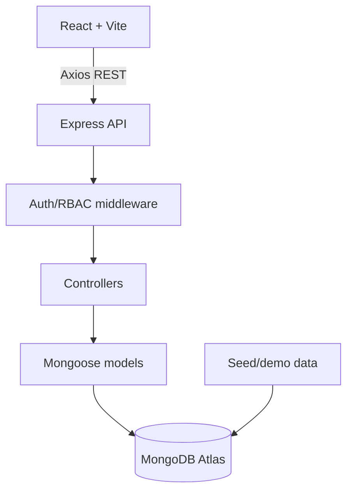
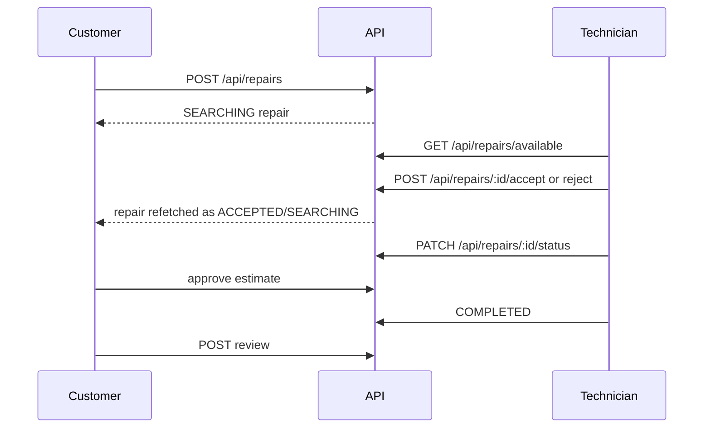

# LocalRepair Architecture

## 1. Overview

LocalRepair connects customers who need appliance repair with verified local technicians. The hackathon MVP is a single MERN application with one React client, one Express API, MongoDB, and seeded demo data.

The primary happy path is:

```text
Customer selects appliance/problem
  → receives a basic diagnosis suggestion
  → views verified technicians
  → creates a repair booking
  → technician accepts or rejects
  → customer and technician see booking status
  → technician sends estimate
  → customer approves
  → technician completes job
  → customer reviews technician
```

## 2. Principles

- Working MVP over completeness.
- One deployable frontend and one deployable backend.
- REST and ordinary request/response state for the MVP; no realtime dependency.
- Server-side authorization and validation for every protected operation.
- Reuse small components and keep abstractions proportional to a one-day build.
- Keep future integrations behind simple seams, without implementing them early.

## 3. MERN architecture



The frontend polls or refetches after user actions when it needs fresh booking state. Socket.IO, email, cloud image storage, maps, and payments are future integrations, not MVP dependencies.

## 4. Frontend architecture

React Router owns route transitions. Feature folders own page-specific API calls and UI composition. A small auth store holds the current user and token/session state; server data should be fetched through the shared API client. Tailwind utility classes and shared UI primitives implement the design system in `DESIGN.md`.

Suggested structure:

```text
frontend/src/
├── components/{ui,cards,forms,layouts}
├── pages/{public,auth,customer,technician}
├── features/{auth,diagnosis,repairs,technicians,reviews}
├── services/{api,auth,repairs,technicians,reviews}
├── store/auth.store.js
├── routes/AppRoutes.jsx
├── utils/
├── App.jsx
└── main.jsx
```

MVP routes:

```text
/                         landing
/login                    login
/register                 registration with role selection
/customer/dashboard       customer overview
/customer/repairs/new     repair/booking wizard
/customer/repairs/:id     booking detail and timeline
/technicians               technician discovery
/technicians/:id           technician profile
/technician/dashboard     technician jobs
/technician/jobs/:id      technician job detail/actions
```

## 5. Backend architecture

The simplest useful request path is `route → middleware → controller → model`. Add a service only for matching, diagnosis rules, or status-transition logic that would otherwise make a controller difficult to read.

```text
backend/src/
├── config/
├── models/                 User, TechnicianProfile, Category, Appliance, Address,
│                           Repair, RepairStatusHistory, Estimate, Review
├── controllers/
├── routes/
├── middleware/             auth, role, validation, error handling
├── services/               matching, diagnosis, repair-status (only as needed)
├── validators/
├── utils/
├── seed.js
├── app.js
└── server.js
```

Notifications, OTP, complaints, admin controllers, uploads, and Socket.IO belong to future work unless the demo explicitly requires them.

## 6. Database architecture

Use one `users` collection for authentication and roles. Use `technicianProfiles` for technician-only data. The lean MVP uses:

- `users`
- `technicianProfiles`
- `categories`
- `appliances`
- `addresses`
- `repairs`
- `repairStatusHistory`
- `estimates`
- `reviews`

The detailed schema and transition rules are in `DATABASE.md`.

## 7. Authentication

Register and login return a JWT. Prefer an HttpOnly cookie with `Secure` in production and `SameSite` configured for the deployment. If the existing starter cannot support cookies quickly, use a short-lived bearer token consistently and document that choice. Passwords are bcrypt hashes and never appear in responses. OTP/email verification is future scope for the MVP; a development-only bypass must never be enabled in production.

## 8. Authorization/RBAC

Roles are `CUSTOMER`, `TECHNICIAN`, and `ADMIN`. Authentication identifies the user; role middleware restricts role-specific routes. Controllers also verify ownership:

- Customers can manage their own appliances, addresses, repairs, estimates responses, and reviews.
- Technicians can manage their own profile and jobs assigned to them or available to them.
- Admin is reserved for future moderation tools and may override status only when that module exists.

Never accept `userId`, `role`, `technicianId`, or an arbitrary status transition from the client as trusted data.

## 9. Modules

1. Auth and user profile
2. Categories, appliances, and addresses
3. Rule-based diagnosis suggestion
4. Technician discovery and profile
5. Repair/booking lifecycle
6. Estimate approval
7. Reviews
8. Demo seed data

## 10. Data flows

### Diagnosis

```text
Problem text + selected category
  → POST /api/diagnosis
  → deterministic keyword/rule service
  → possible issue, urgency, next step
  → customer confirms/edits
  → confirmed data is included in repair creation
```

Diagnosis is guidance only; the technician's diagnosis and estimate are authoritative.

### Technician matching

Filter verified and available profiles by category and service area. If coordinates exist, sort by distance using the `2dsphere` index; otherwise sort by rating and completed jobs. Return a small list, not a recommendation engine.

### Booking



The allowed MVP status path is `SEARCHING → ACCEPTED → TECHNICIAN_ON_WAY → ARRIVED → DIAGNOSING → ESTIMATE_SENT → CUSTOMER_APPROVED → IN_PROGRESS → COMPLETED`; `SEARCHING` or `ACCEPTED` may become `CANCELLED`. `REJECTED` is an action result that leaves the unassigned repair in `SEARCHING` so another technician can accept it.

## 11. Deployment

```text
Vercel (React/Vite) → Render/Railway (Express) → MongoDB Atlas
```

Configure `VITE_API_URL`, `MONGO_URI`, `JWT_SECRET`, `CLIENT_URL`, and `NODE_ENV` through the hosting provider. Seed demo data against a safe demo database only.

## 12. Security baseline

Use Helmet, a CORS allowlist, rate limiting on auth, bcrypt, JWT expiry, input validation, ObjectId validation, safe error messages, upload limits if uploads are enabled, and environment variables for secrets. Apply ownership checks in backend controllers and do not expose password hashes or private tokens.

## 13. MVP versus future

| MVP now | Future after the demo |
|---|---|
| JWT auth, roles, seeded users | OTP/email verification and password reset |
| Rule-based diagnosis suggestion | AI diagnosis |
| Verified technician list | Maps and advanced geo matching |
| Repair booking and status timeline | Socket.IO realtime notifications |
| Estimate approval and review | Payments, chat, subscriptions |
| Basic demo-ready UI | Admin moderation, complaints, analytics, cloud uploads |

